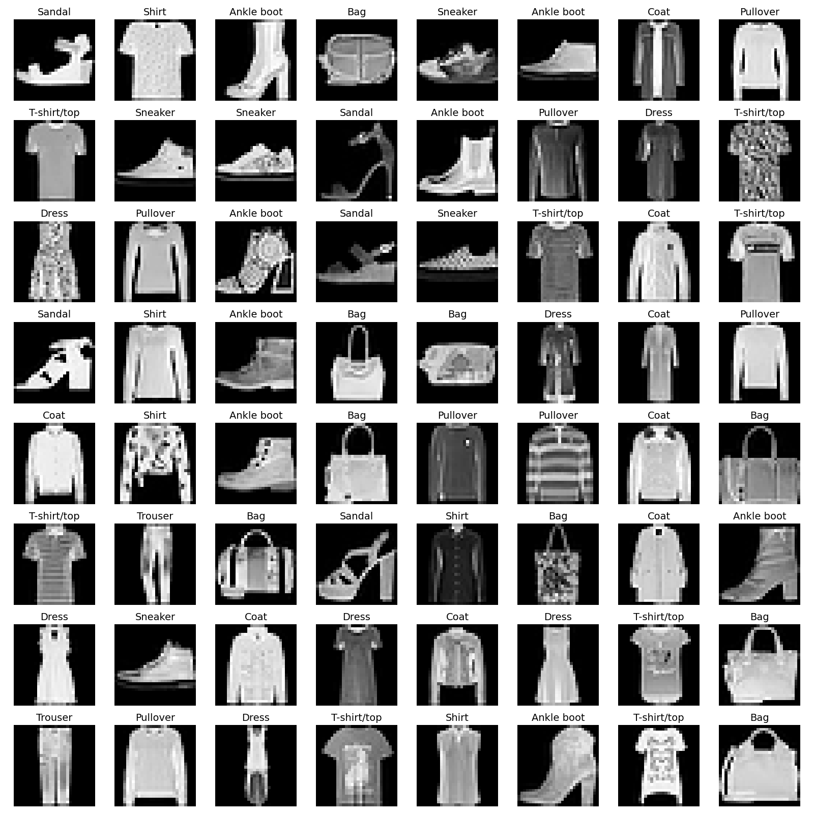
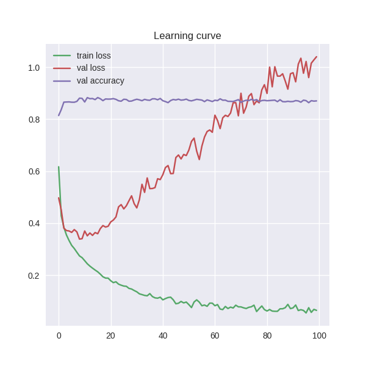
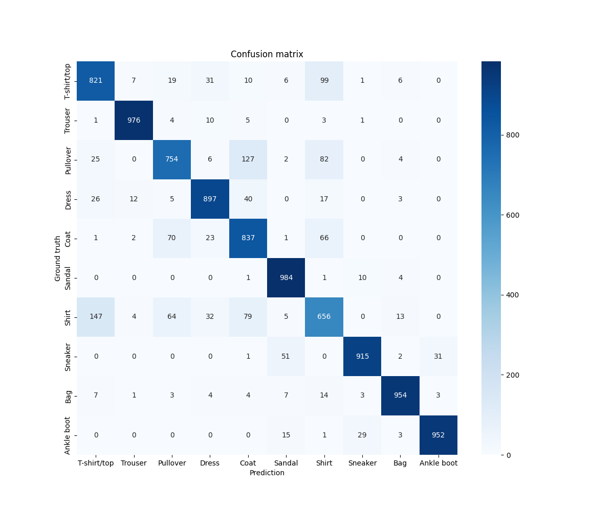
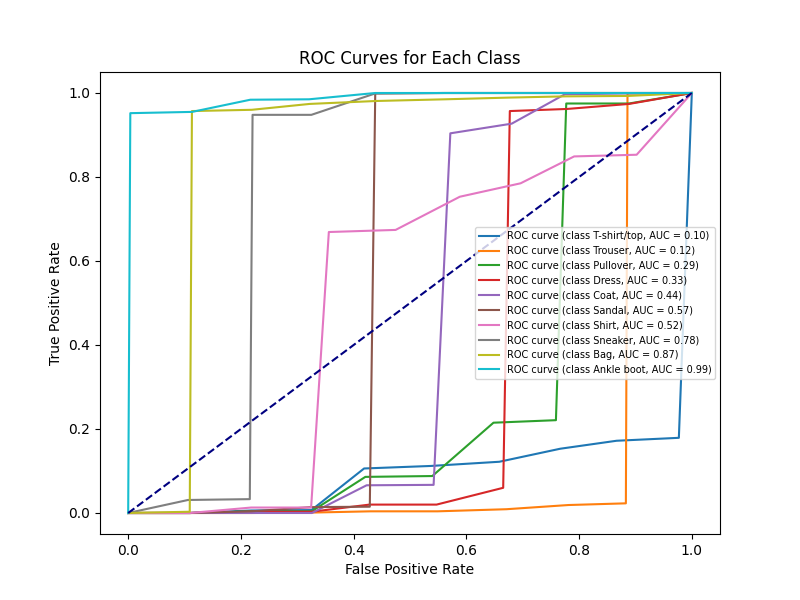

# Task Assesment

## Environment & Requirements

**Virtual Environment**

```bash
python -m venv test-env
source test-env/bin/activate
```

**Install requirements**
```bash
pip install -r requirements.txt
```

## Task 1 : Creating a Neural Network


#### Neural Network

### How to run?

After activating the environment use [run.sh](run.sh) file to run train or test. You can adjust number of epochs, learning rate, batch size, num of workers as well as checkpoints directory. 

```bash
bash run.sh
```
or

```bash
python main.py -b 64 -j 4 --num_epochs 100 --train --checkpoints_dir checkpoints
```
Here is the breakdown of usage command line.

<details>
<summary><b>Usage</b></summary>

```bash
usage: main.py [-h] [-b BATCH_SIZE] [-j NUM_WORKERS] [--num_epochs NUM_EPOCHS] [--lr LR] [--train] [--test] [--checkpoints_dir CHECKPOINTS_DIR] [--checkpoints_name CHECKPOINTS_NAME]

options:
  -h, --help            show this help message and exit
  -b BATCH_SIZE, --batch_size BATCH_SIZE
                        Batch size
  -j NUM_WORKERS, --num_workers NUM_WORKERS
                        Number of workers
  --num_epochs NUM_EPOCHS
                        Number of epochs
  --lr LR               Learning rate
  --train
  --test
  --checkpoints_dir CHECKPOINTS_DIR
                        Checkpoints path
  --checkpoints_name CHECKPOINTS_NAME
                        Checkpoints path
```
</details>

In this task, a simple neural network is created using `PyTorch` to classify `Fashion Mnist` dataset. The model is trained through a Convolution Neural Network.

This network takes a grayscale image as input. In the first convolution layer, 6 filters are used and a kernel of size `5x5` with activation layer Rectified Linear Unit aka ReLU. Then a max pooling layer with kernel size `2x2` with stride of 2. In the second convolution layer, the number filters are used is 16 with same kernel size as of first convolution layer. Again ReLU is used to maintain the non-linearity and the same pooling layer.

In fully connected layers 1, the output is flattened for single dimension and total number of input features are `16x4x4` with 120 output features and a ReLU activation. In addition to this, fully connected layers 2 take the 120 ouput features from layer 1 as inputs and outputs 84 output layers. Since, fashion mnist dataset is consists of 10 classes so the output layer gives 10 output features.

#### Training Options

**Loss function:** CrossEntropyLoss is suitable for multi-class classification problems is reason to use this.

**Optimizer:** Stochastic Gradient Descent is commonly used optimizer for training neural networks.

**Learning rate:** Learning rate is a hyperparameter that determine the step size during optimization. `0.001` is used as common scenario.

#### Dataset

**Download** the fashion-mnist data from [[HERE]](https://drive.google.com/file/d/1t3SAakzIW-gKi09W9PeKM7oI2Fmfr_kJ/view?usp=sharing) and keep the folder `fashion-mnist` inside data directory. This folder contains `fashion-mnist_train.csv` and `fashion-mnist_test.csv` files.

Here, Fashion Mnist dataset is used which has 10 classes with size `28x28` given below with indexes.

| Index | 0 | 1 | 2 | 3 | 4 | 5 | 6 | 7 | 8 | 9 |
|-------|---|---|---|---|---|---|---|---|---|---|
| Class | T-shirt/top | Trouser | Pullover | Dress | Coat | Sandal | Shirt | Sneaker | Bag | Ankle boot |

A visual representation of fashion-mnist dataset.



The dataset contains `60000` train images and `10000` test images. Here, the train images are splitted for training and evaluation. We trained `70%` of the images for training and rest `30%` for evaluating the trained model while training. 

#### Evaluation and Accuracy

The model is trained using 100 epochs with learning rate `0.001`. The model has got the accuracy of `87%`

Training and evaluation loss metrics



|Confusion Matrix|ROC Curve|
|-------|-------|
|  |  |

Here, a confusion matrix of the model test is given and ROC curve has shown for each classes. Overall, The model has learnt most for the Sandal class and least on 656. The scores such as total accuracy, Precision, Recall and F1-score of this model are saved on [scores.txt](runs/scores.txt).

## Task 2 : Working with Database

### How to run?

Use the Python script [crud.py](crud.py) to run this.

`python crud.py -c -f /path/to/image`

<details>
<summary><b>Usage</b></summary>

```bash
usage: crud.py [-h] [-c] [-r] [-u] [-d] [-a] [-f FILEPATH] [--id ID] [--update_data UPDATE_DATA]

options:
  -h, --help            show this help message and exit
  -c, --create          Create
  -r, --read            Read
  -u, --update          Update
  -d, --delete          Delete
  -a, --all             Get all record
  -f FILEPATH, --filepath FILEPATH
                        File to image path
  --id ID               Record ID ex: 1
  --update_data UPDATE_DATA
                        Data to update
```
</details>

Since, it is just a simple task of database interation with python that's why instead of using heavy databases like MySQL or MongoDB, here sqlite3 is used. This program is based on previous task 1 of fashion mnist model. Here, an image will be sent and in background it will be predicted of which class it belongs to and the result will be shown as well as saved into the database. Then, the record can be delete, read or update. If, the result is given wrong user can update the data with correct prediction finding the record by index.

## Task 3 : Integration with a Google API

This task is done by using `Python Flask` and Google `Geocoding API`. However, it's not going to work as expected. Google API demands billing which I currently don't have. Yet, it can send a request to the `Google API` with error message.

This API takes address of a place as input and shows the geocoding information such as Place Name, Latitude, Longitude and Place ID.

### How to run?

```bash
python app.py
```

## Task 4 : Documentation

This github repository itself.